# Various manufacturer's ELRS EP2 receivers
| Manufacturer | Front | Back |
| ------------ | ----- | ---- |
| betafpv | 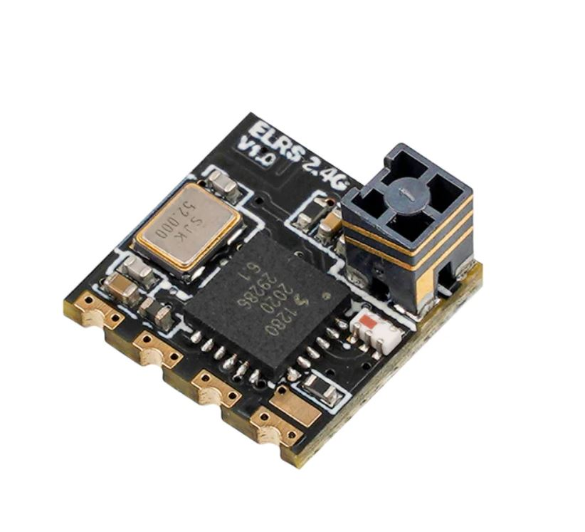 | 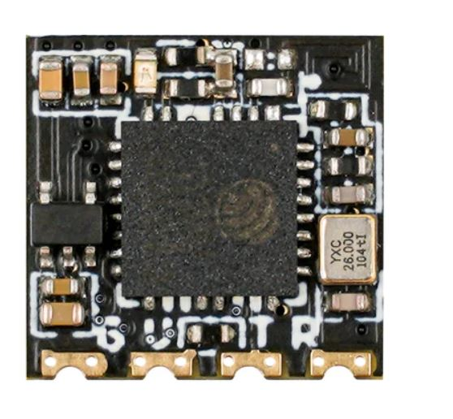 |
| flywoo | 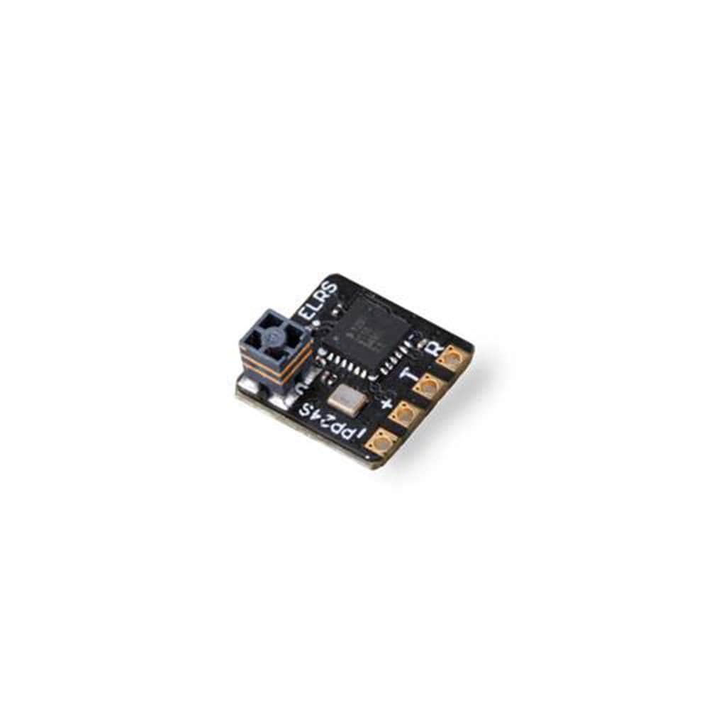 | 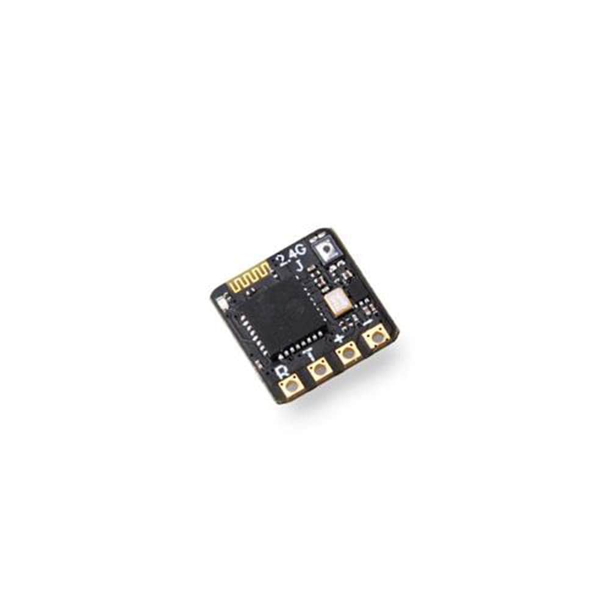 |
| happymodel | 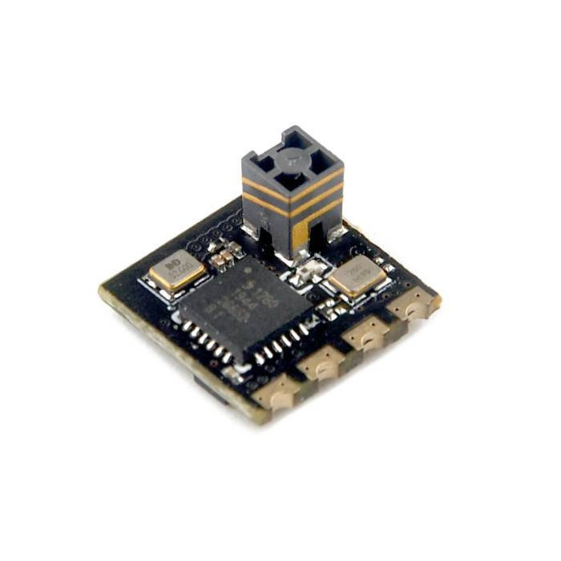 | 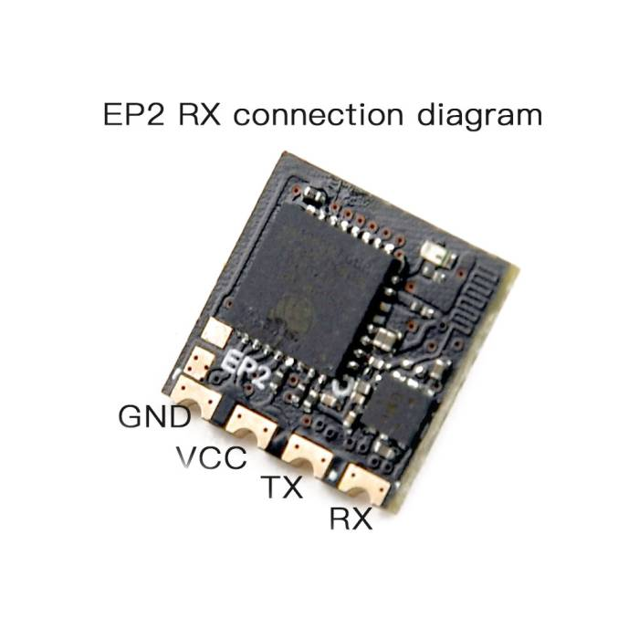 |
| jhemcu | 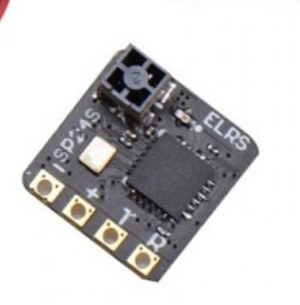 | 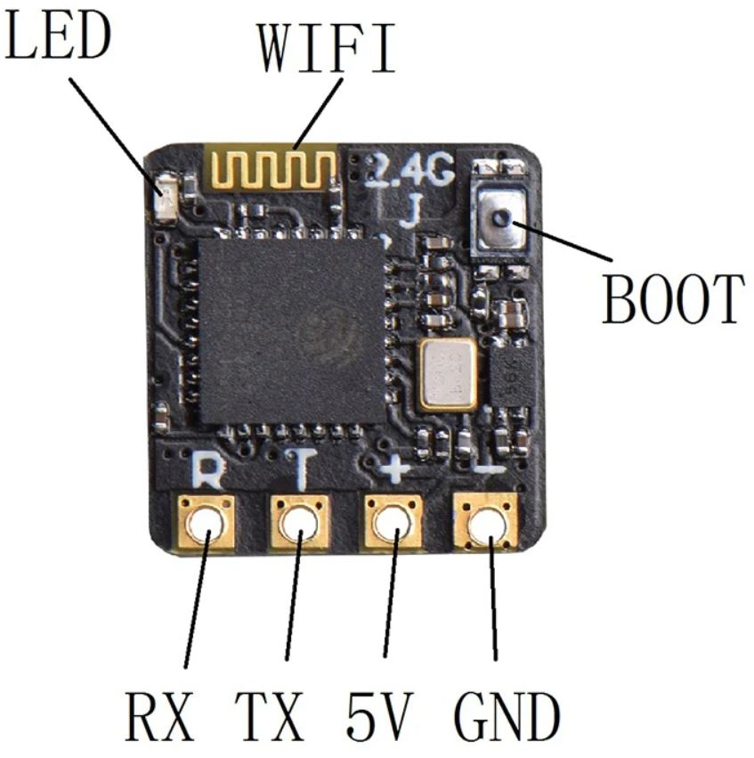 |
| namino | 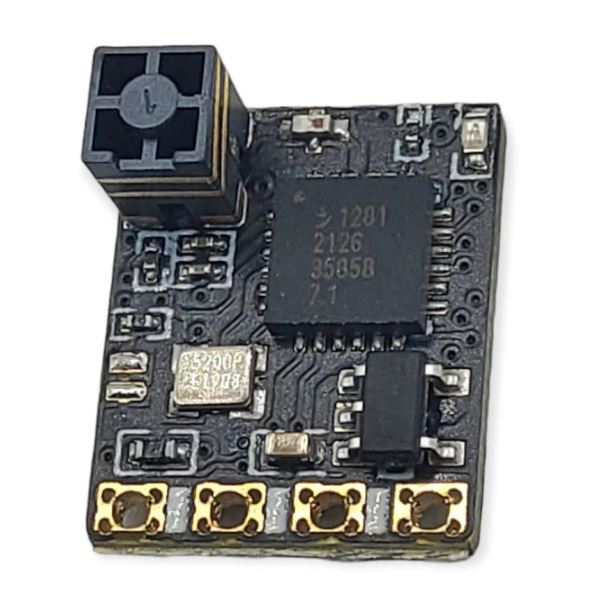 | 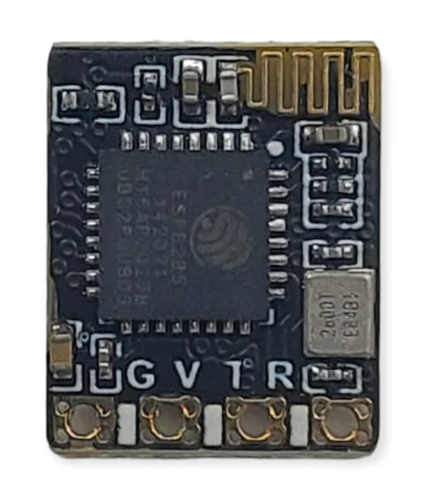 |
| radiomaster | 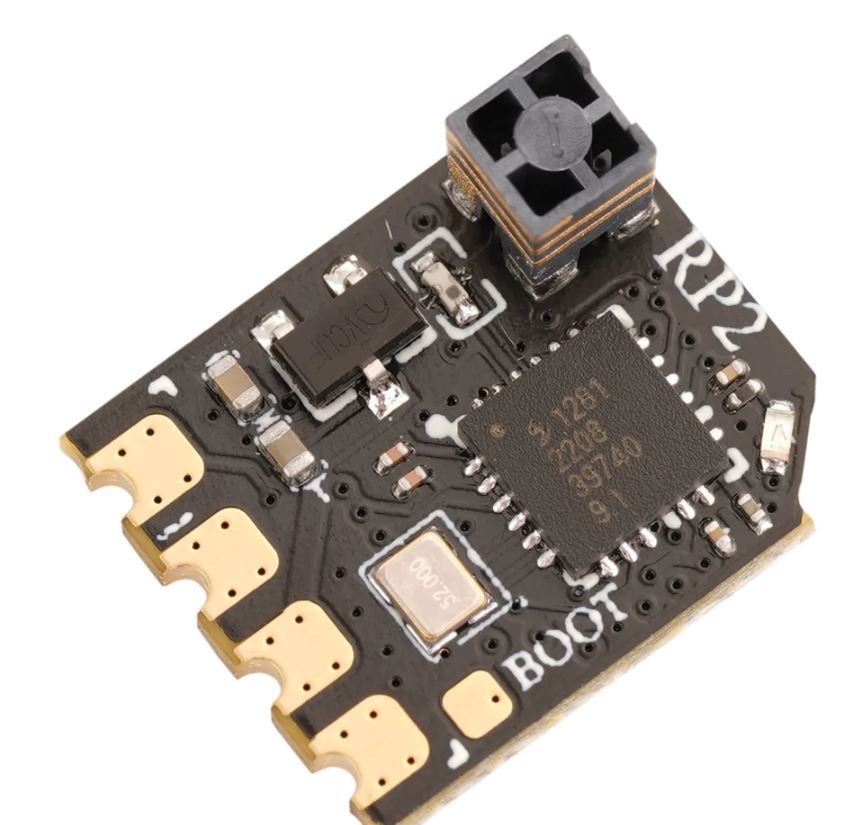 | 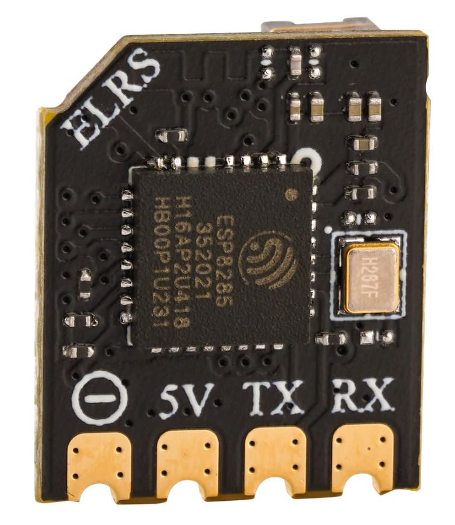 |